# Reporting Issues Project 
Mini-project - FRM MAS-RAD

A Web application allowing to report issues

This repository contains the source code for a simple reporting issues web application for a small project of FRM course (MAS-RAD course).

Author: Marta Costa
Version: 1.0

#### Requirements ####
- A Java application server (using Tomcat v8.5 Server)
- DataBase : MySQL Server v6.3
- Build Tool : Apache-Maven v3.5.0 (in eclipse --> Import -> existing Maven Projects)
- Use JSF primefaces

#### Project Environment ####
- JSF 2.2.5
- Maven 3
- Eclipse Java EE IDE for Web Developers - Version: Neon.2 Release (4.6.2)
- JDK 1.8
- Tomcat 8.5

#### Features ####

1. [Login Page](#login)
2. [Register Page](#register)
3. [Homepage](#homepage)
 * [logout](#logout)
 * [Create an issue](#issueNew)
 * [Edit an issue](#issueEdit)
 * [Delete an issue](#issueDelete)
 * [Search issues](#issueSearch)
 * [More Details](#issueDescription)
 * [Detailed issue](#issueDetails)
4. [Issue Details Page](#issueDetailsPage)
 * [Comments](#comments)

## 1. Login Page

When the application first starts, the user is redirected to the Login Page.
In the login page the user is asked to enter his username and password to be identified in the application. 
If the provided information is not correct, the user will be informed with a message, otherwise the user will be connected to the application and redirected to the home page of the application.

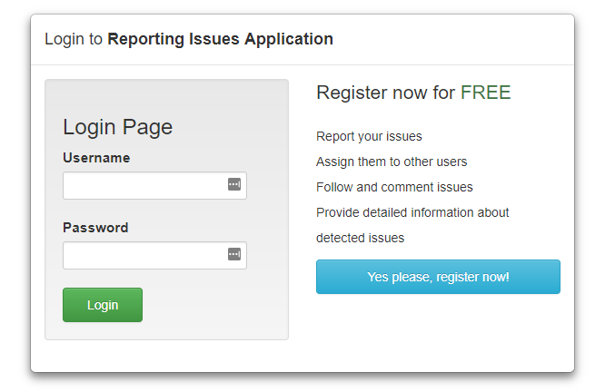

## 2. Registration Page

If the user choses the register option by clicking the button "Yes please, register now!", he's asked to enter an username, email and a password (only username and password are mandatory). Then he has to click on the register button of the screen below:

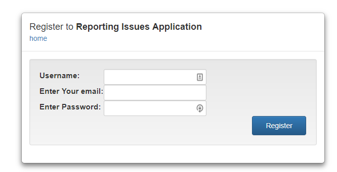

After successful resgitration the application redirects the user to the login page to login with the created username:

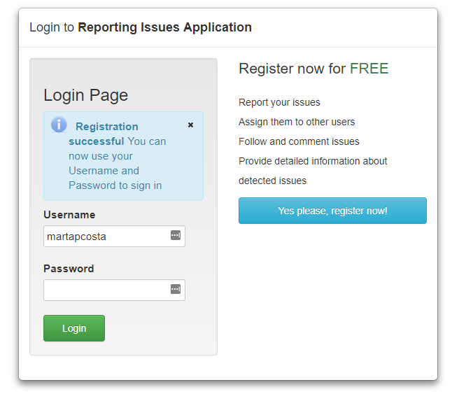
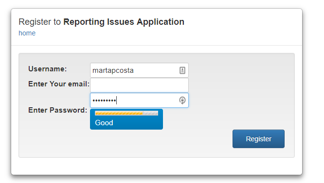

## 3. Homepage

The homepage shows the issues that are already created (all issues):

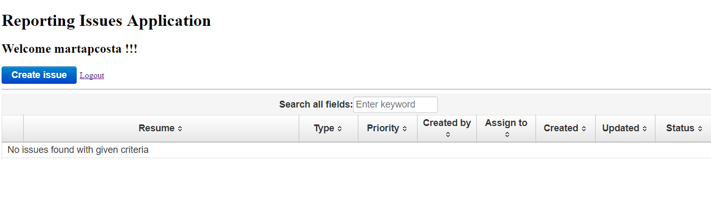

### 3.1 Logout

For sign off, the user only have to click the option below:

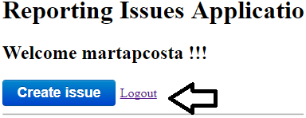

### 3.2 Create an issue

To create a new issue the user has to click the button "Create Issue".

After clicking this button a dialog opens, the user has then to fill the form:

- Subjet: subject of the issue
- Type of demand: the type of issue from the given options
- Description: a description giving the details of the issue that is beeing created
- Assign to: the username that he wants to assign the issue that is beeing created
- State: the status of the issue from the given options
- Priority: the priority of the issue from the given options

In the end the user can save the issue by clicking the button "Save" or he can exit without saving by clicking the "Close" option:

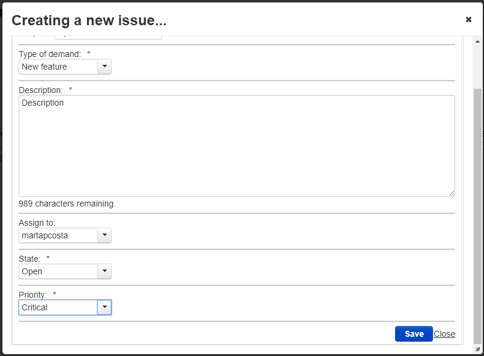

After saving an issue the user is redirect to the homepage, where the table is automatically updated with the new issue.

### 3.3 Edit an issue

If the user wants to delete or edit an issue he has to click-right on the row of the table for intended Issue.

When he right-clicks the row corresponding to the issue he wants to delete/edit, he'll be able to see the options below: 

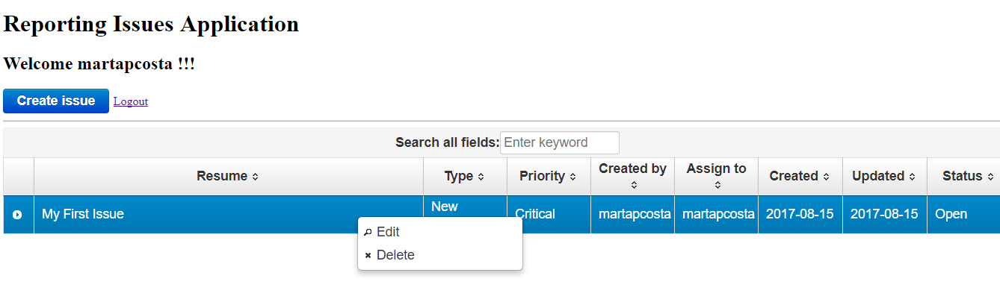

If he choses the "Edit" option, a dialog form will open pre-filled with the issue information. He then can change the information he wants and save by clicking the "Save" button:

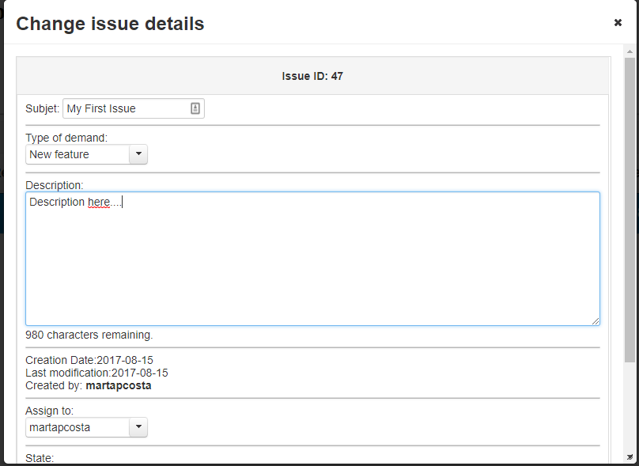

### 3.4 Delete an issue

If he choses the "Delete" option, the issue will be deleted: 

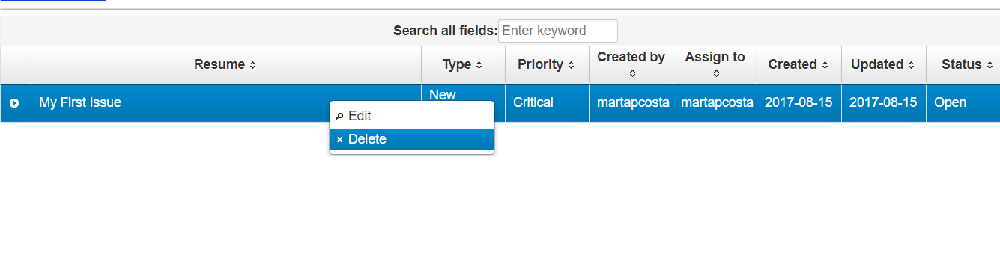

### 3.5 Search issues

The application provides an option to search for searching if an issue contains a the searched word (the search option only looks for information that is in the table)

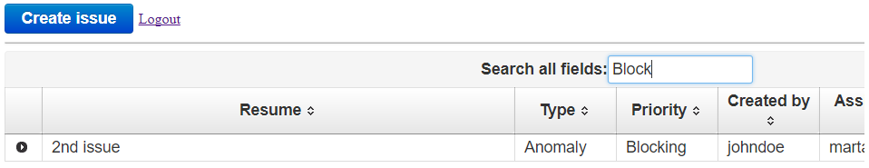

### 3.6 More Details

Since the description's issue is not part of the information provided in the table, the user can see this description by clicking on 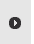 (the first column of each row)

After clicking the "description" shows up below the clicked row:

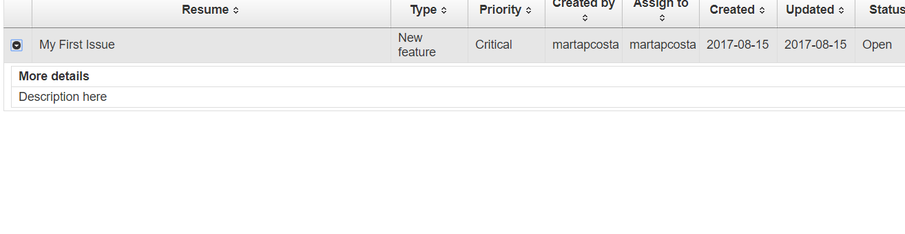

### 3.7 Detailed issue

The application also provides the option to the all the information about an issue on another page. 

This option is accessible by clicking the row of the chosen issue.

After clicking the user is redirect the to issue details page:

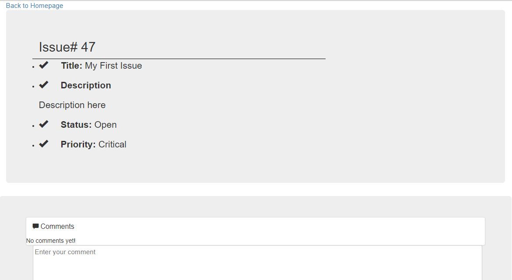

## 4. Issues Details Page

From the issue details page, the user can go back to the homepage by clicking the option below:
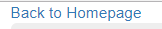

### 4.1 Comments

In the issue details page, each user can make comments on an issue. He just has to write his comment and click the "Add comment" button:

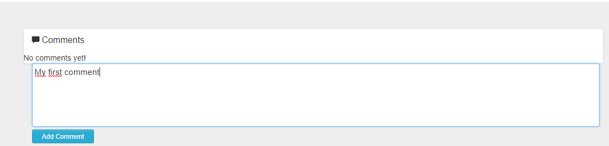

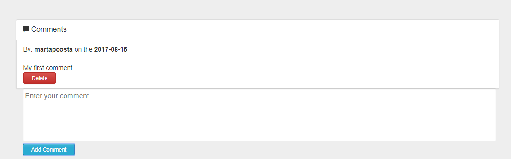

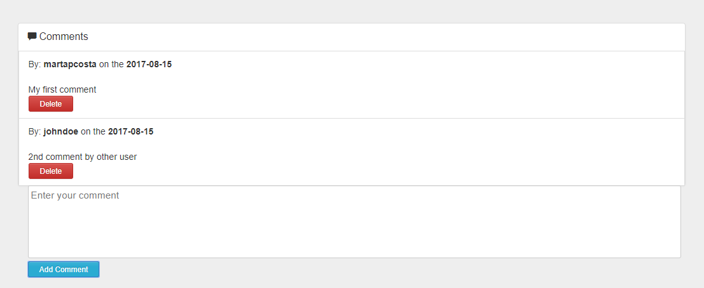

Comments can also be deleted by clicking the "Delete" button.
